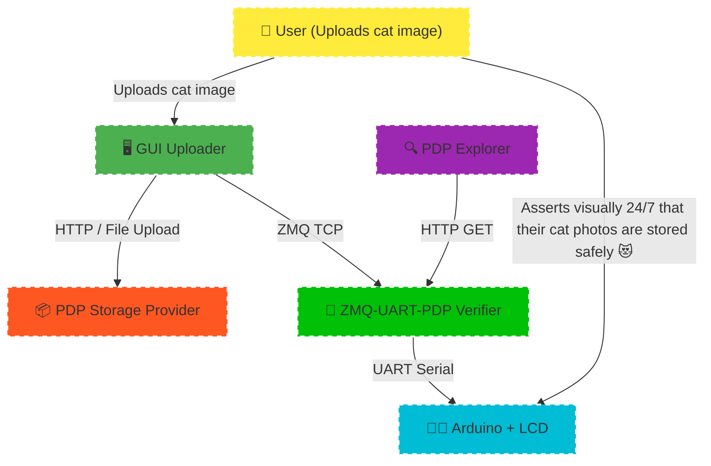

# PDP Hackathon

```mermaid
flowchart TD
    %% Style Nodes
    style GUI fill:#4CAF50,stroke:#ffffff,stroke-width:2px,stroke-dasharray: 5,10
    style SP fill:#FF5722,stroke:#ffffff,stroke-width:2px,stroke-dasharray: 5,10
    style Verifier fill:#00C107,stroke:#ffffff,stroke-width:2px,stroke-dasharray: 5,10
    style Arduino fill:#00BCD4,stroke:#ffffff,stroke-width:2px,stroke-dasharray: 5,10
    style Explorer fill:#9C27B0,stroke:#ffffff,stroke-width:2px,stroke-dasharray: 5,10
    style User fill:#FFEB3B,stroke:#ffffff,stroke-width:2px,stroke-dasharray: 5,10
    
    %% Nodes Definition with Emojis
    User["👤 User (Uploads cat image)"]
    GUI["🖥️ GUI Uploader"]
    SP["📦 PDP Storage Provider"]
    Verifier["🔌 ZMQ-UART-PDP Verifier"]
    Arduino["🧑‍🔧 Arduino + LCD"]
    Explorer["🔍 PDP Explorer"]

    %% Arrows Definition
    User -->|Uploads cat image| GUI
    GUI -->|HTTP / File Upload| SP
    GUI -->|ZMQ TCP| Verifier
    Verifier -->|UART Serial| Arduino
    Explorer -->|HTTP GET| Verifier
    User -->|Asserts visually 24/7 that their cat photos are stored safely 😻| Arduino

    %% Add Bold to Key Arrows for Emphasis
    classDef keyArrow fill:#FFC107,stroke:#FF5722,stroke-width:3px;
    class GUI,SP,Verifier,Arduino,Explorer keyArrow
```
